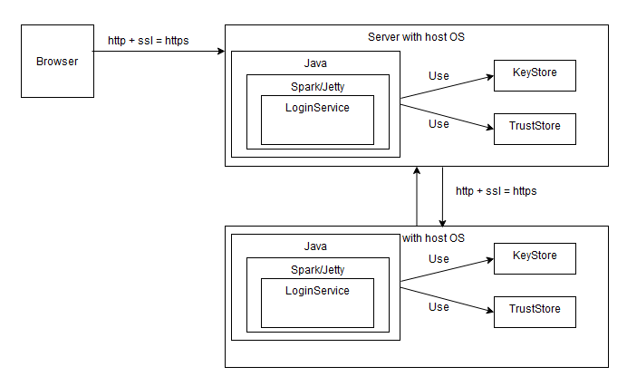
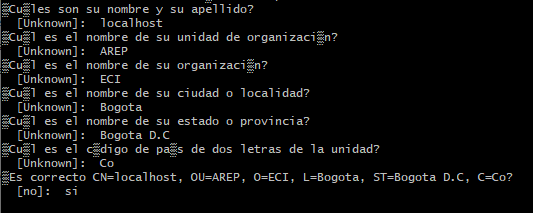

# Aplicación distribuida segura en todos sus frentes 

En el repositorio se encontrarán los archivos necesarios para realizar el despliegue de un servidor seguro
y un servidor auxiliar, ya sea de manera local o usando AWS como plataforma. 

## Arquitectura



## Despliegue de manera local
1. Clonar el proyecto 

```
git clone https://github.com/laura-gar/AREP-Security.git
```


2. Crear nueva llave
- Eliminar el contenido de la carpeta /keystore
- Generar una nueva llave: 
  ```
  keytool -genkeypair -alias ecikeypair -keyalg RSA -keysize 2048 -storetype PKCS12 -keystore ecikeystore.p12 -validity 3650
  ```
  
- Al generar la llave, se pedirá crear una clave además de llenar ciertos campos. A continuación 
  se presenta una posible configuración. 

  

- Exportar el certificado al archivo 
  ```
  keytool -export -keystore ./ecikeystore.p12 -alias ecikeypair -file ecicert.cer
  ```
  
- Exportar el certificado a un TrustStore
  ```
  keytool -import -file ./ecicert.cer -alias firstCA -keystore myTrustStore
  ```

2. Compilar el proyecto 

```
mvn clean install
```

3. Correr el servidor auxiliar. 

```
java -cp "target/classes;target/dependency/*" edu.escuelaing.arep.HelloServer
```

4. Correr el servidor 

```
java -cp "target/classes;target/dependency/*" edu.escuelaing.arep.App
```

## Despliegue en AWS 

1. Crear dos instancias de EC2
2. Instalar java `sudo yum install java-1.8.0-openjdk`y git `sudo yum install git -y`en cada instancia 
3. Clonar el repositorio
  ```
git clone https://github.com/laura-gar/AREP-Security.git
```

4. Correr el servidor auxiliar.

```
java -cp "target/classes:target/dependency/*" "edu.escuelaing.arep.HelloServer"
```

5. Correr el servidor

```
java -cp "target/classes:target/dependency/*" "edu.escuelaing.arep.App"
```


## Construido con
- Spark, como Framework de Java para el desarrollo Backend.
- Bootstrap, como Framework para el diseño Frontend.
- JavaScript, como lenguaje usado en el cliente para manejar los eventos del usuario.
- Docker y docker-compose, como herramienta para la generación y control de los contenedores.


## Autor
-  Laura García 